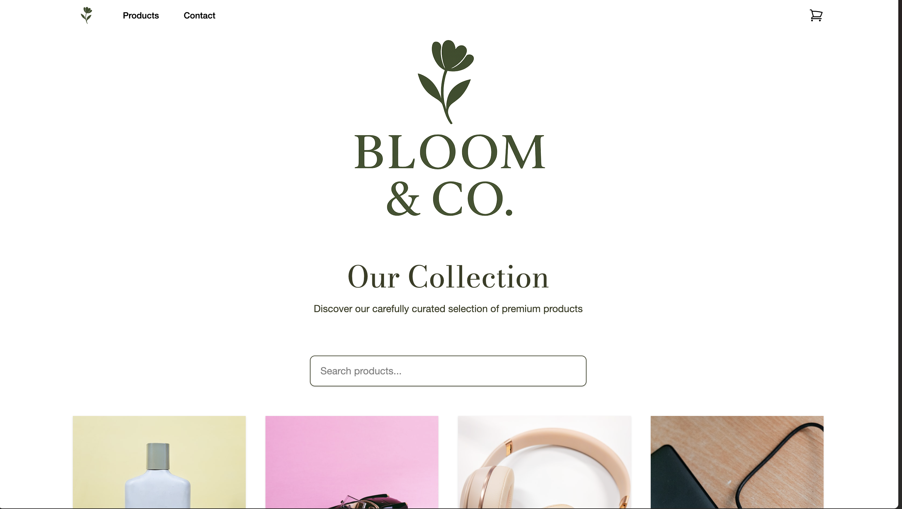

# JavaScript Frameworks CA – Bloom & Co.




A React-based online flower shop built for the JavaScript Frameworks Course Assignment, focused on clean UI, reusable components, and stable integration with the Noroff Online Shop API v2.

## Description

This project is a modern e-commerce flower shop that allows users to browse products, search in real time, add items to a shopping cart, and complete a full checkout flow. The application is designed with usability and performance in mind, using reusable React components and a clean, responsive layout.

You can add some bullet points if you'd like to:

- Browse flower products from the Noroff Online Shop API
- Real-time product search (look-ahead filtering)
- View detailed product pages with reviews and discounts
- Add and manage items in the shopping cart
- Complete a full checkout flow with a success page
- Contact form with validation

## Built With

You can list the tech stack that you've used over here

- [React 19](https://react.dev/)
- [Vite](https://vitejs.dev/)
- [React Router 6](https://reactrouter.com/)
- [Tailwind CSS](https://tailwindcss.com/)
- [Noroff Online Shop API v2](https://docs.noroff.dev/)

## Getting Started

### Installing

1. Clone the repo:

### 1. Install Dependencies
```bash
npm install
```

### 2. Set Up Environment
Create a `.env` file in the root directory:
```
VITE_API_URL=https://v2.api.noroff.dev
VITE_API_KEY=your-api-key-here
```
Get your API key from [Noroff API Documentation](https://docs.noroff.dev/).

### 3. Run the Project

```bash
npm run build
```
Deploy the `dist/` folder to Netlify or any static hosting service.

### For Testers

1. **Setup**: Follow Quick Start above
2. **Test User Registration**: Try creating a new account
3. **Test Login**: Login with registered credentials
4. **Test Bidding**: Login and place a bid on an active listing
5. **Test Create Listing**: Go to profile page and create a new auction
6. **Check Errors**: Try invalid actions like bidding without login
7. **Mobile Test**: Check responsiveness on mobile devices
8. **API Errors**: Test behavior when API is unavailable

### Project Structure

- `src/pages/` - Page components (Home, Product, Cart, Checkout Success, Contact)
- `src/components/` - Reusable UI components
- `src/layout/` - Layout wrapper (Header + Footer)
- `src/context/` - Global cart state management
- `public/` - Static assets
- `app/` - App router structure

### API

Uses Noroff Online Shop API v2. All requests are handled via environment variables using the base URL and API key.

## Contributing

Fork the repository

Create a feature branch

Make your changes

Push your branch

Open a Pull Request

## Contact

If you wish to reach me, you can contact me here:

**Email:** Farhia.dahir.addow@gmail.com

## Acknowledgments

Special thanks to Noroff and the Noroff API team for providing clear documentation and access to the Online Shop API.
